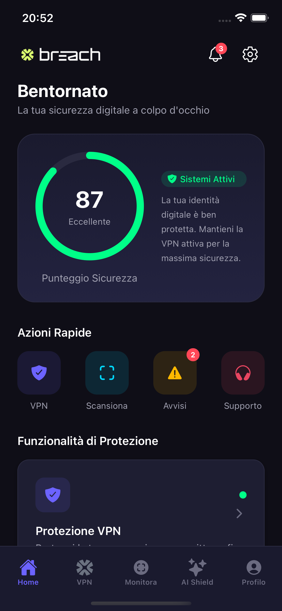
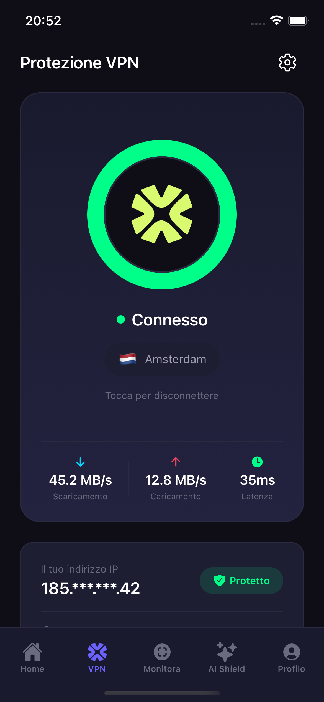
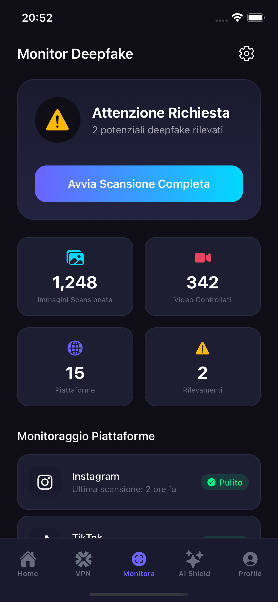
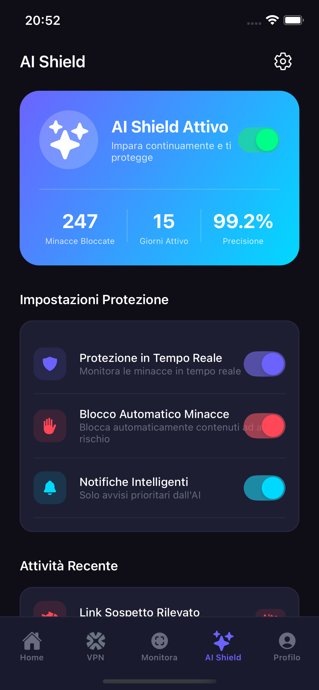
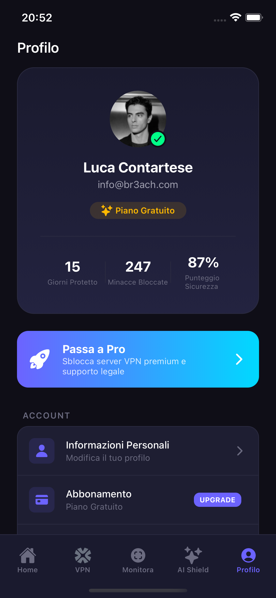

<p align="center">
  
</p>

<h1 align="center">Br3ach</h1>

<p align="center">
  <strong>La tua sicurezza digitale quotidiana</strong>
</p>

<p align="center">
  
  
  
  
</p>

<p align="center">
  <i>"La sicurezza digitale non dovrebbe essere un privilegio di pochi, ma un diritto di tutti."</i>
</p>

---

## Download

<p align="center">
  <a href="https://github.com/Spettacolo83/br3ach/raw/main/releases/Br3ach-v1.0.0-preview.apk">
    
  </a>
  &nbsp;&nbsp;
  <a href="https://github.com/Spettacolo83/br3ach/raw/main/releases/Br3ach-v1.0.0-preview.ipa">
    
  </a>
</p>

### Installazione su Android

1. **Scarica l'APK** cliccando sul badge sopra o [da questo link](https://github.com/Spettacolo83/br3ach/raw/main/releases/Br3ach-v1.0.0-preview.apk)
2. **Abilita "Origini sconosciute"** nelle impostazioni del tuo dispositivo:
   - Vai in `Impostazioni > Sicurezza > Origini sconosciute` (o `Installa app sconosciute`)
   - Abilita l'opzione per il browser o file manager che utilizzi
3. **Apri il file APK** scaricato e tocca "Installa"
4. **Avvia l'app** Br3ach dal menu delle applicazioni

### Installazione su iOS

1. **Scarica l'IPA** cliccando sul badge sopra o [da questo link](https://github.com/Spettacolo83/br3ach/raw/main/releases/Br3ach-v1.0.0-preview.ipa)
2. **Installa con uno di questi metodi:**
   - **Xcode:** `Window > Devices and Simulators` → trascina l'IPA sul dispositivo
   - **Apple Configurator 2:** Trascina l'IPA sull'icona del dispositivo
   - **Diawi.com:** Carica l'IPA per ottenere un link installabile
3. **Autorizza lo sviluppatore** su iPhone: `Impostazioni > Generali > Gestione dispositivo`

> **Nota:** L'IPA richiede che il dispositivo sia registrato nel profilo di provisioning Ad Hoc. Per distribuzione più ampia, usa TestFlight.

> **Nota:** Questa è una versione preview/demo dell'MVP. Alcune funzionalità sono simulate per scopi dimostrativi.

---

## Panoramica

**Br3ach** è un'applicazione mobile all-in-one per la protezione dell'identità digitale. Progettata per rendere la cybersecurity accessibile a tutti, l'app combina tecnologie avanzate in un'interfaccia semplice e intuitiva.

## Screenshot

<p align="center">
  
  
  
  
  
</p>

<p align="center">
  <sub>Home • VPN • Rilevamento Deepfake • AI Shield • Profilo</sub>
</p>

## Funzionalità

### Protezione VPN
- Crittografia **AES-256** di livello militare
- **Kill Switch** automatico
- Protezione **DNS leak**
- Server in tutto il mondo
- Politica **No-Log** garantita

### Rilevamento Deepfake
- Scansione AI dei contenuti
- Monitoraggio social media
- Alert in tempo reale
- Report dettagliati

### AI Threat Shield
- Protezione intelligente adattiva
- Analisi comportamentale
- Blocco minacce proattivo
- Machine learning continuo

### Supporto Legale
- Assistenza legale specializzata
- Supporto per furto d'identità
- Consulenza privacy GDPR
- Network di esperti

## Stack Tecnologico

| Tecnologia | Scopo |
|------------|-------|
| **React Native** | Framework mobile cross-platform |
| **Expo SDK 52** | Piattaforma di sviluppo e API native |
| **Expo Router v4** | Navigazione basata su file |
| **TypeScript** | Sviluppo type-safe |
| **React Native Reanimated** | Animazioni fluide |
| **Linear Gradient** | Gradienti UI |

## Architettura

```
br3ach/
├── app/                      # Expo Router - Schermate
│   ├── (tabs)/              # Navigazione tab
│   │   ├── index.tsx        # Home - Dashboard sicurezza
│   │   ├── vpn.tsx          # VPN - Connessione e server
│   │   ├── monitor.tsx      # Monitoraggio deepfake
│   │   ├── ai.tsx           # Stato AI Shield
│   │   └── profile.tsx      # Impostazioni utente
│   └── _layout.tsx          # Layout principale
├── components/              # Componenti UI riutilizzabili
│   ├── Header.tsx           # Header di navigazione
│   ├── VPNToggle.tsx        # Toggle connessione VPN
│   ├── SecurityScore.tsx    # Widget punteggio sicurezza
│   ├── FeatureCard.tsx      # Card funzionalità
│   └── ...
├── constants/
│   └── theme.ts             # Token design system
└── assets/
    └── images/              # Asset del brand
```

## Design System

### Colori

| Colore | Hex | Utilizzo |
|--------|-----|----------|
| Primario | `#6C63FF` | Colore brand principale, CTA |
| Accento | `#00D9FF` | Evidenziazioni, link |
| Sfondo | `#0F0E17` | Sfondo app |
| Successo | `#00FF88` | Stati connesso, sicuro |
| Attenzione | `#FFB800` | Alert, notifiche |
| Errore | `#FF4757` | Errori, disconnesso |

### Colore Brand
| Br3ach Blue | `#1b42f3` | Colore ufficiale del brand |

## Come Iniziare

### Prerequisiti

- Node.js 18+
- npm o yarn
- Expo CLI (`npm install -g expo-cli`)
- Simulatore iOS (Mac) o Emulatore Android

### Installazione

```bash
# Clona il repository
git clone https://github.com/Spettacolo83/br3ach.git
cd br3ach

# Installa le dipendenze
npm install

# Avvia il server di sviluppo
npm start

# Esegui su iOS
npm run ios

# Esegui su Android
npm run android
```

### Build APK

```bash
# Build locale (richiede Android SDK)
export ANDROID_HOME=$HOME/Library/Android/sdk
npx eas build --platform android --profile preview --local
```

## Roadmap

- [x] MVP UI/UX completo
- [x] Sistema di navigazione tab
- [x] Toggle VPN con stati
- [x] Dashboard punteggio sicurezza
- [x] Profilo utente
- [ ] Integrazione SDK VPN nativo
- [ ] Backend API
- [ ] Sistema di autenticazione
- [ ] Notifiche push
- [ ] Scansione AI deepfake
- [ ] Integrazione pagamenti

## Contribuire

Questo progetto è un MVP per Br3ach. Per contribuire o collaborare, contattare il team.

## Team

Sviluppato con passione per **Br3ach** - La sicurezza digitale per tutti.

## Licenza

Proprietario © 2025 Br3ach. Tutti i diritti riservati.

---

<p align="center">
  <strong>Br3ach</strong> - Proteggiamo le identità digitali, un utente alla volta.
</p>
